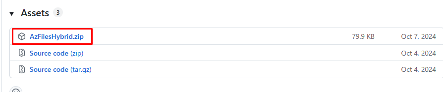
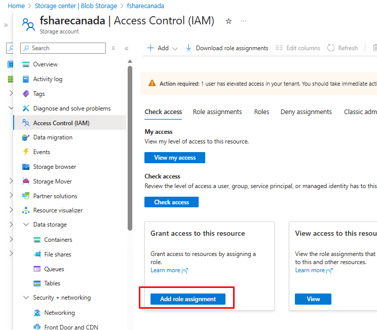
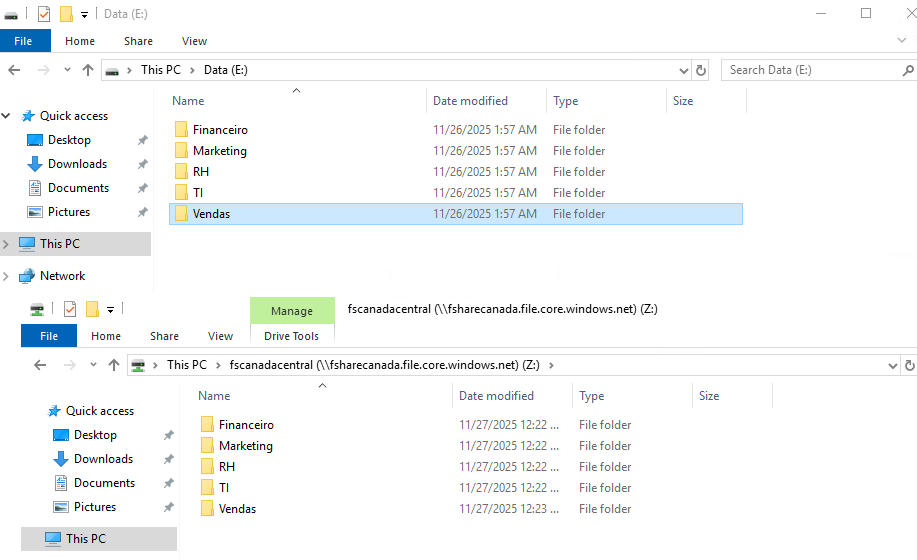
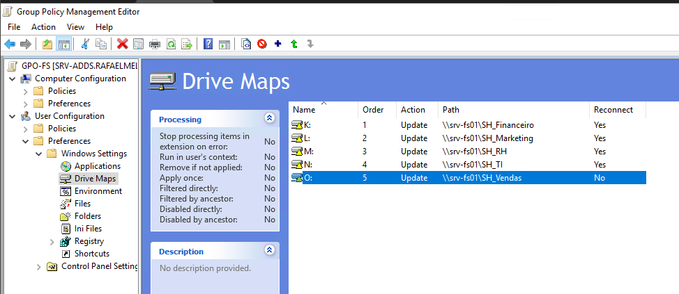

1 - Joindre Azure FS à l'AD

* Installer le module PowerShell Azure sur le serveur de fichiers on-prem
```
Set-ExecutionPolicy -ExecutionPolicy Unrestricted -Scope CurrentUser
Install-Module -Name Az -AllowClobber -Scope CurrentUser
```
* Télécharger les scripts pour ajouter le compte de stockage au domaine AD DS sur le serveur de fichiers on-prem

https://github.com/Azure-Samples/azure-files-samples/releases



* Copier les scripts vers le serveur de fichiers on-prem C:\scripts\AzFilesHybrid et les décompresser

* Personnaliser les scripts pour ajouter le Storage Account avec l'authentification AD DS activée

https://learn.microsoft.com/en-us/azure/storage/files/storage-files-identity-ad-ds-enable

* Dans PowerShell ISE du serveur de fichiers on-prem, accéder au répertoire C:\scripts\AzFilesHybrid.

* Ouvrir le script storage-files-identity-ad-ds-enable.ps1 sur le serveur de fichiers on-prem et personnaliser les paramètres

```
cd C:\scripts\AzFilesHybrid

PS C:\scripts\AzFilesHybrid> dir


    Directory: C:\scripts\AzFilesHybrid


Mode                LastWriteTime         Length Name                                                                                                                                                                            
----                -------------         ------ ----                                                                                                                                                                            
------        10/4/2024   9:34 PM          21597 AzFilesHybrid.psd1                                                                                                                                                              
------        10/4/2024   9:34 PM         337351 AzFilesHybrid.psm1                                                                                                                                                              
------        10/4/2024   9:34 PM          15201 CopyToPSPath.ps1  

```

* Dans le script storage-files-identity-ad-ds-enable.ps1, exécuter les 3 premières commandes

```
# Change the execution policy to unblock importing AzFilesHybrid.psm1 module
Set-ExecutionPolicy -ExecutionPolicy Unrestricted -Scope CurrentUser

# Navigate to where AzFilesHybrid is unzipped and stored and run to copy the files into your path
.\CopyToPSPath.ps1 

# Import AzFilesHybrid module
Import-Module -Name AzFilesHybrid
```

* Se connecter à Azure directement dans le navigateur puis exécuter la commande pour se connecter à Azure qui générera un lien et un code d'authentification

```
Connect-AzAccount -DeviceCode
```

* Renseigner les informations sur les ressources Azure dans le script.
* REMARQUE : ajouter l'utilisateur qui exécutera le script aux autorisations SMB du compte de stockage

```
Storage File Data SMB Share Contributor
Storage File Data SMB Share Elevated Contributor
```

```
$SubscriptionId = "xxxxx-d574-4e0e-b0fa-xxxxxxxx"
$ResourceGroupName = "rg-azure"
$StorageAccountName = "fsharecanada"
$SamAccountName = "fsharecanada"
$DomainAccountType = "ComputerAccount" # Default is set as ComputerAccount
# If you don't provide the OU name as an input parameter, the AD identity that represents the 
# storage account is created under the root directory.
$OuDistinguishedName = "OU=Storage,DC=rafaelmellonh,DC=com,DC=br"
# Encryption method is AES-256 Kerberos.

# Select the target subscription for the current session
Select-AzSubscription -SubscriptionId $SubscriptionId 
```

* Après avoir renseigné les informations, exécuter le reste du script pour

```
Summary of checks:
Name                             Result 
----                             ------ 
CheckKerberosTicketEncryption    Passed 
CheckChannelEncryption           Skipped
CheckADObjectPasswordIsCorrect   Passed 
CheckADObject                    Passed 
CheckAadKerberosRegistryKeyIsOff Passed 
CheckUserFileAccess              Skipped
CheckDomainJoined                Passed 
CheckPort445Connectivity         Passed 
CheckGetKerberosTicket           Passed 
CheckDomainLineOfSight           Passed 
CheckDefaultSharePermission      Passed 
CheckStorageAccountDomainJoined  Passed 
CheckAadUserHasSid               Skipped
CheckUserRbacAssignment          Passed 
CheckSidHasAadUser               Passed 
```

* REMARQUE : désactiver l'expiration du mot de passe de l'objet dans l'AD (storage)
```
Set-ADComputer -Identity "fsharecanada" -PasswordNeverExpires $true
Get-ADComputer "fsharecanada" -Properties PasswordNeverExpires | Select Name,PasswordNeverExpires
```

* Ajouter les utilisateurs/groupes AD aux autorisations du compte de stockage (groupes ou utilisateurs doivent être synchronisés dans ADConnect)

```
Storage File Data SMB Share Contributor
Storage File Data SMB Share Elevated Contributor # para admin
```



* Mapper le partage du compte de stockage sur le serveur de fichiers on-prem avec l'utilisateur qui est dans le groupe Storage File Data SMB Share Contributor pour effectuer la migration et la gestion du partage.
Utiliser la  ``` Storage account key ``` pour mapper le partage sur le serveur de fichiers on-prem.

* Créer les répertoires racine des partages à l'intérieur du share qui a été mappé sur le serveur de fichiers on-prem pour gérer et rompre l'héritage des permissions du compte de stockage.




* Tester la connexion directe au stockage avec un utilisateur appartenant au groupe Storage File Data SMB Share Contributor (\\fsharecanada.file.core.windows.net\\fscanadacentral)

* Exécuter robocopy pour migrer les fichiers du serveur de fichiers on-prem vers le compte de stockage

```
robocopy \\srv-fs01\e$\RH Z:\RH /E /TEE /ETA /MT:32 /MIR /R:0 /W:0 /COPY:DATS /LOG:C:\scripts\RH.TXT
```

* Avant d'ajuster les GPOs, il est nécessaire de configurer le private link et le private endpoint sur le compte de stockage pour que la connexion se fasse via le réseau privé et non via Internet.

* Avant




* Après


