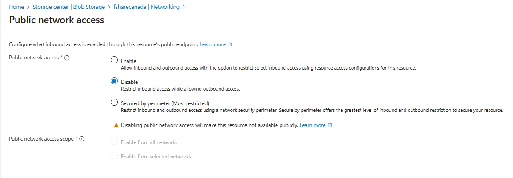
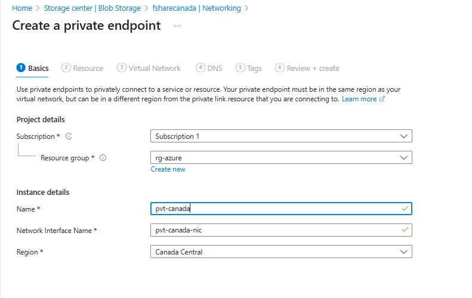
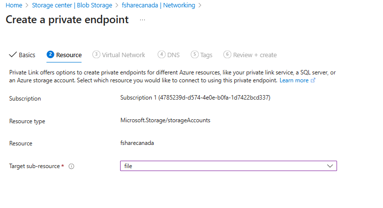
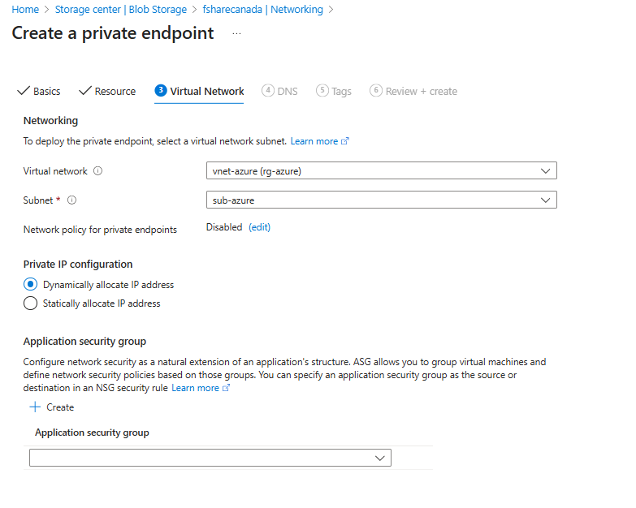
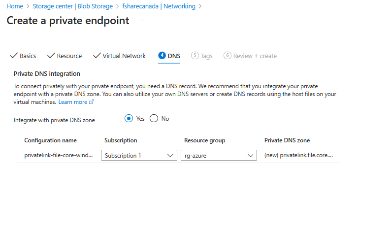
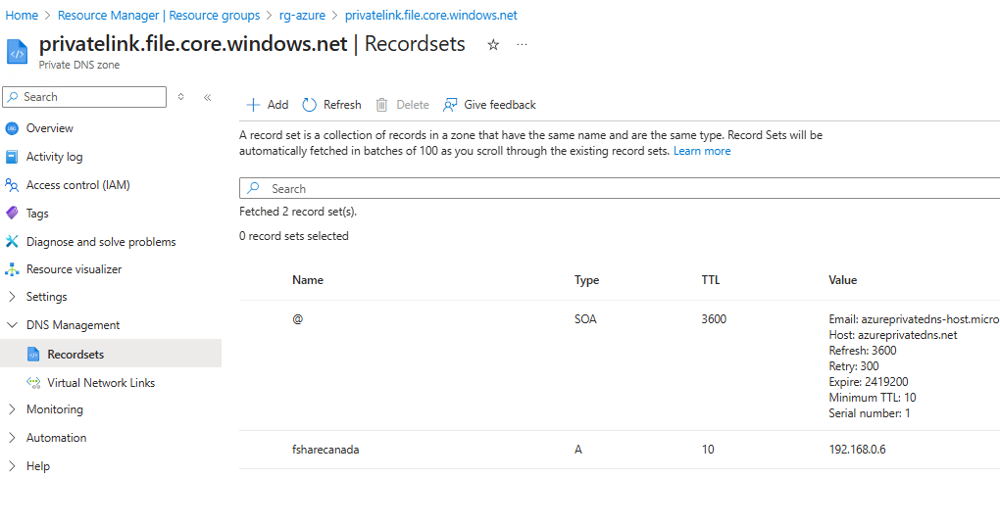
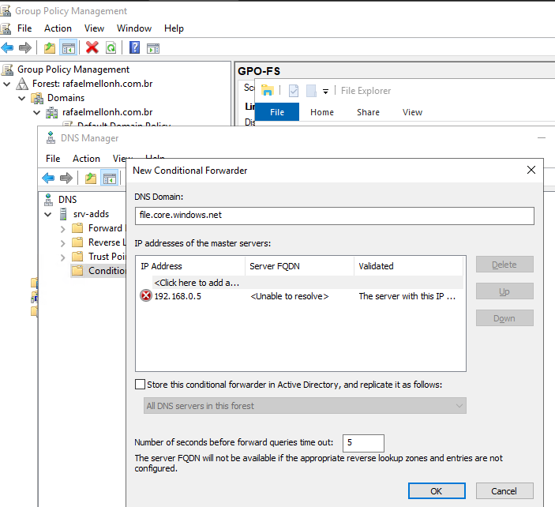
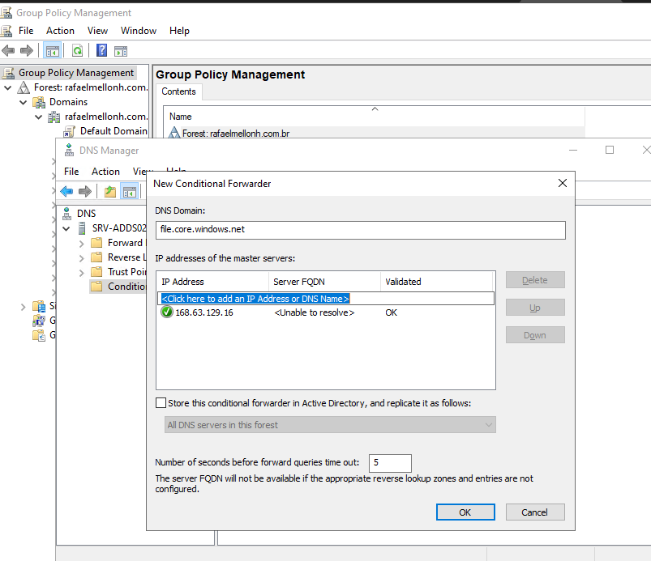
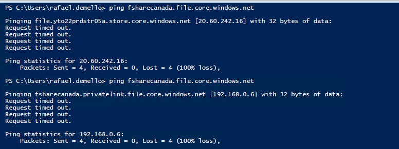

* Désactiver l'accès public au compte de stockage (l'accès au share sera perdu)



* Créer le point de terminaison privé sur le compte de stockage










* Vérifier et créer

* Valider l'IP du file share dans la zone DNS créée dans Azure.




* Créer une règle de transfert dans le DNS on-prem pointant vers le serveur DNS dans Azure.

```
file.core.windows.net ->  192.168.0.5
```



* Sur le serveur DNS dans Azure, créer un transfert pointant vers l'IP DNS global d'Azure.

  


* Test de ping avant et après la création du Private Endpoint et des transferts :


