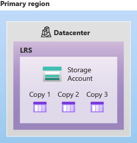
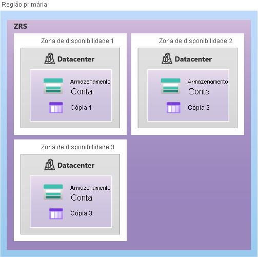
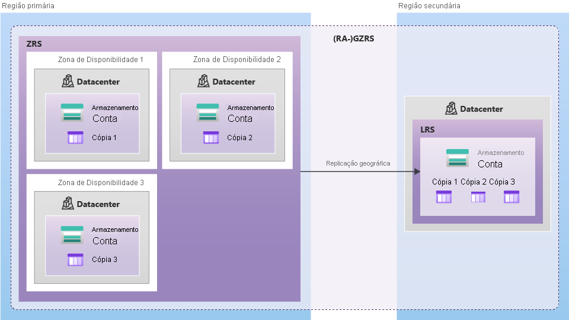

<<<<<<< HEAD

https://learn.microsoft.com/en-us/azure/storage/files/storage-files-identity-ad-ds-enable

Name : MPWFS02.telefilm.gc.ca
Domain : telefilm.gc.ca

DNS Active Directory Azure :

Custom DNS servers
tfc-ad01 : 10.103.172.4 - Canada East
tfc-ad02 : 10.104.172.4 - Canada Central

RG : tfc-prod-rg

Qual RG do Azure?
Replicacao ?  LRS OU ZRS ou GZRS    https://learn.microsoft.com/en-us/azure/storage/common/storage-redundancy

 
| Tipo | Cópias | Onde replica | Protege contra | Ideal para |
|------|--------|-----------------------------|------------------------|------------------------------|
| **LRS** | 3 | Um único datacenter | Falhas locais pequenas | Teste, dev, backups simples |
| **ZRS** | 3+ | 3 zonas de disponibilidade | Queda de zona | Apps críticos |
| **GZRS** | ZRS + réplica geográfica | Zonas + região secundária | Queda total da região | Alta resiliência empresarial |

CONTA DO AZURE TEM QUE SER NO MINIMO CONTRIBUTOR
E DO AD TEM QUE TER PERMISSAO PARA ADICIONAR O STORAGE ACCOUNT AO DOMINIO

=======
Name : MPWFS02.telefilm.gc.ca
Domain : telefilm.gc.ca

Entra ID?
Quota?
Deduplicacao?

CONTA DO AZURE TEM QUE SER NO MINIMO CONTRIBUTOR
E DO AD TEM QUE TER PERMISSAO PARA ADICIONAR O STORAGE ACCOUNT AO DOMINIO

1. Gpo - update
2. Regiao
3. SKU
4. Network/private endpoint?
5. create file share
6. join AD ( add o file server no ad)
7. Install powershell 
8. download and executar scripts
9. Roles no Azure 
    smb data contributor
    smb share elevated contributor
10. Adicionar os grupos ou usuarios do AD na role smb data contributor
11. Mapear file share em um servidor local com storage account key para gerenciar o share
12. criar pasta com mesmo nome dentro do share para migracao
13. Usar robocopy para migrar e levar permissoes, com ele pode migrar aos poucos
14. robocopy \\origem Z:\destino /E /TEE /ETA /SEC /MT:32 /MIR /R:0 /W:0 /COPYALL /B /XD /LOG:C:\FS-MGT.TXT

Voces tem alguma conexao com o escritorio onde esta o file server com o azure (VPN ou ExpressRoute)?
Os usuarios irao acessar o file share somente do escritorio?
O active directory esta no azure e sincronizado com o on-premises?
>>>>>>> 77b59ec637ccf3ecf7f5a12c03a1c883d9ca9cdf
